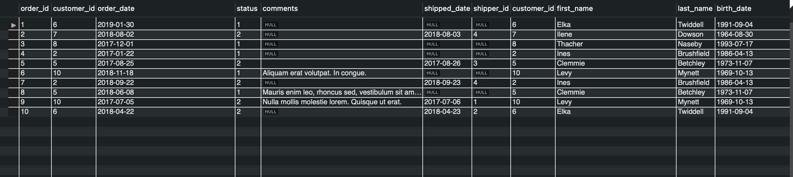
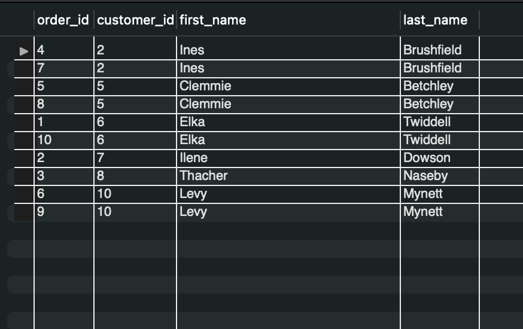

## JOIN OR Inner Join


We can use keyword JOIN instead of INNER JOIN it does the same functionality .


```sql
SELECT *
FROM orders
JOIN customers
```

This join command will  join orders table in the left and customers table on the right and the form of join will be LIKE adding every customers table record to all orders table records .


```sql
SELECT * FROM orders 
JOIN customers 
ON orders.customer_id = customers.customer_id
```

Now we add the condition orders.customer_id = customers.customer_id we have only the rest of equal customer_id values

PS : We can write in the query JOIN or INNER JOIN .



```sql
SELECT order_id , orders.customer_id , first_name , last_name  
FROM orders 
JOIN customers 
ON orders.customer_id = customers.customer_id
```

Finally we can get the columns we want from both tables .

PS: for customer_id we have two fields with the same name , so we had to specify the table .



PS : For short format we can make shortcut for tabales name o for orders , and c for customers 

```sql
SELECT order_id , o.customer_id , first_name , last_name  
FROM orders o
JOIN customers c
ON o.customer_id = c.customer_id
```
